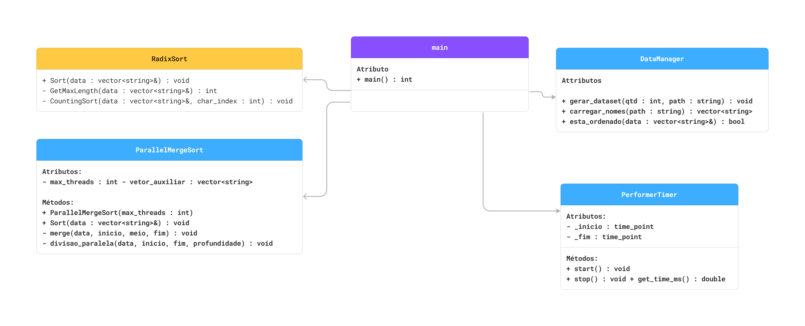

# G5_Ordenacao_EDA2-2026.1

# Ordenacao_ListasDeNomes

Número da Lista: G5  
Conteúdo da Disciplina: Algoritmos de Ordenação

## Alunos

| Matrícula | Aluno |
| -- | -- |
| 23/1030771 | Henrique F G Passos |
| 23/1011696 | Luiz Guilherme Morais da Costa Faria |

## Sobre

Este projeto implementa e compara dois algoritmos de ordenação aplicados
a listas de nomes completos (nome, nome do meio e sobrenome):

- **Radix Sort** — algoritmo de ordenação por dígitos, aplicado caractere
  a caractere usando Counting Sort interno
- **Parallel Merge Sort** — algoritmo de ordenação por divisão e conquista
  com suporte a execução paralela via threads

O programa gera um dataset de nomes brasileiros aleatórios com a quantidade
definida pelo usuário, ordena com cada algoritmo e compara o tempo de execução.

## Vídeo de Apresentação

...

## Screenshots

...

## Instalação

Linguagem: **C++ 17**  
Build system: **CMake 3.26+**

### Pré-requisitos

- CMake 3.26 ou superior
- Compilador C++ com suporte a C++17 (AppleClang, GCC ou Clang)

### Passos

**1. Clone o repositório:**
```bash
git clone https://github.com/eda2-2026/G5_Ordenacao_EDA2-2026.1.git
cd G5_Ordenacao_EDA2-2026.1
```

**2. Crie a pasta de build e compile:**
```bash
mkdir build
cd build
cmake .. -DCMAKE_CXX_COMPILER=/usr/bin/clang++
cmake --build .
```

**3. Execute o programa:**
```bash
./G5_Ordenacao_EDA2_2026_1
```

**4. Informe a quantidade de nomes quando solicitado:**
```
Quantos nomes deseja gerar? 50000
```

## Outros

### Documentações do projeto

#### Diagrama UML do Projeto



### Complexidade

| Algoritmo | Melhor caso | Caso médio | Pior caso | Espaço |
|---|---|---|---|---|
| Radix Sort | O(n·k) | O(n·k) | O(n·k) | O(n+k) |
| Parallel Merge Sort | O(n log n) | O(n log n) | O(n log n) | O(n) |

Onde `n` é o número de nomes e `k` é o comprimento máximo de uma string.

O Radix Sort tende a ser mais eficiente quando as strings têm comprimento
similar, pois evita comparações diretas. O Parallel Merge Sort se beneficia
de múltiplos núcleos do processador, reduzindo o tempo real de execução
através de paralelismo.

### Possíveis melhorias

- Exportar os resultados de tempo para CSV e gerar gráficos de performance
- Testar com volumes maiores (100k, 500k, 1M de nomes)
- Implementar versão iterativa do Merge Sort para evitar estouro de pilha
- Adicionar suporte a acentuação na ordenação dos nomes