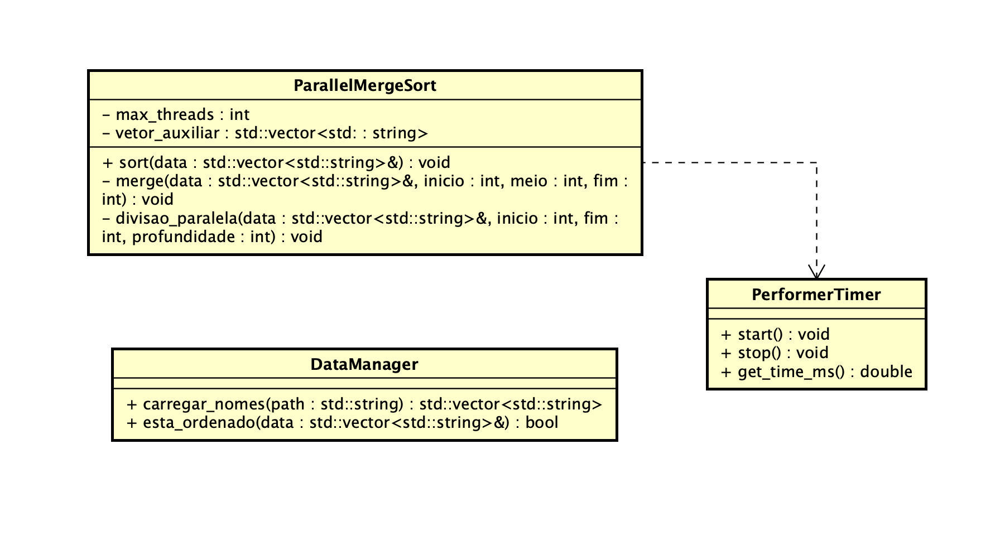

# G5_Ordenacao_EDA2-2026.1

# Ordencao_ListasDeNomes

Número da Lista: G5
Conteúdo da Disciplina: Algoritmos de Ordenção 

## Alunos

| Matrícula | Aluno |
| -- | -- |
| 23/1030771 | Henrique F G Passos |
| 23/1011696 | Luiz Guilherme Morais da Costa Faria |

## Sobre

...

## Vídeo de Apresentação

...

## Screenshots

...
...
...

## Instalação

Linguagem: **C++ 17** 
Build system: **CMake** 

### Pré-requisitos

- CMake 3.26 ou superior
- Compilador C++ (GCC, Clang ou MSVC)

### Passos

...
...
...

## Outros

### Documetações do projeto

#### Diagrama UML do Projeto

...
...

### Complexidade

...

### Possíveis melhorias

...
